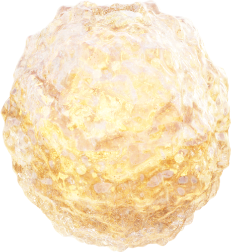

# OpenStone: Crystal Gemstone Generation & Rendering Pipeline

A comprehensive system for generating organic gemstones with metallic engravings and rendering them with professional quality materials and lighting.



## Overview

This repository provides tools for:
- Generating gemstone definitions from text prompts
- Creating organic crystalline structures
- Rendering gemstones with advanced materials and lighting

## Features
- **🤖 AI-Powered Generation**: Generate unique gemstones from text descriptions using OpenAI or fallback algorithms
- **🔷 Modular Mesh System**: Extensible geometry generators for different crystal types (organic, cut, raw, geode, custom)
- **🎨 Advanced Materials**: Multiple material styles including realistic, stylized, crystalline, and metallic accents
- **💡 Dynamic Lighting**: Professional lighting setups (studio, natural, dramatic, cinematic)
- **🌍 World Environments**: Customizable backgrounds (HDRI, gradient, solid color, nebula)
- **🛠️ Extensible Architecture**: Easy to add custom mesh generators, materials, and lighting setups
- **📸 Cinematic Rendering**: Film-quality output with advanced post-processing

## Quick Start

1. **Clone this repository:**
   ```bash
   git clone https://github.com/yanimeziani/openstone.git
   cd openstone
   ```

2. **Install dependencies:**
   ```bash
   pip install -r requirements.txt
   ```

3. **Set up Blender:**
   - Install Blender 3.0+ (4.5+ recommended) from [blender.org](https://www.blender.org/download/)
   - Ensure Blender is accessible from command line or update the `blender_path` in `run_gem_creator.py`

4. **Optional: Set up OpenAI API:**
   ```bash
   export OPENAI_API_KEY="your-api-key-here"
   ```

5. **Run the demo:**
   ```bash
   python openstone_main.py generate "A mystical blue crystal with golden infinity symbol"
   ```

## Usage Examples

### Basic Usage
```bash
python openstone_main.py generate "A fiery red ruby with silver dragon engravings"
```

### Custom Gem Generation with Fallback
```bash
# Works with or without OpenAI API
python openstone_main.py generate "A mystical emerald with golden phoenix patterns"
```

### Using the Modular System
```bash
# Use the new modular system
python openstone_main.py generate "A mystical emerald with golden dragon engravings"

# Create from existing JSON
python openstone_main.py create examples/gem_spec.json

# List available options
python openstone_main.py list
```

### Create Stunning Renders
```bash
# Create a dramatic cinematic render
python create_cinematic_render.py

# Create a premium showcase render
python create_premium_showcase.py
```

## File Structure

```
openstone/
├── openstone/                  # Main package
│   ├── __init__.py            # Package initialization
│   ├── ai_generator.py        # AI gemstone specification generator
│   ├── mesh_creator.py        # Extensible mesh generation system
│   ├── material_manager.py    # Advanced material and shading system
│   └── lighting_manager.py    # Dynamic lighting and world system
├── examples/                   # Example scripts and templates
│   ├── custom_mesh_example.py      # How to create custom mesh generators
│   ├── custom_material_example.py  # How to create custom materials
│   ├── custom_lighting_example.py  # How to create custom lighting
│   └── premium_showcase.png        # Premium showcase render output
├── openstone_main.py          # Main CLI interface for modular system
├── create_cinematic_render.py  # Cinematic render creation script
├── create_premium_showcase.py  # Premium showcase render generator
├── requirements.txt           # Python dependencies
├── .gitignore                 # Git ignore rules
├── README.md                  # This documentation
├── LICENSE                    # MIT License
└── CONTRIBUTING.md            # Contribution guidelines
```

## Requirements

### System Requirements
- **Blender 3.0+** (4.5+ recommended)
- **Python 3.8+**
- **Operating System:** macOS, Linux, or Windows

### Python Dependencies
- `openai>=1.0.0` (optional, for AI generation)
- Standard library modules: `json`, `pathlib`, `subprocess`, etc.

## Installation

### Option 1: Standard Installation
1. **Install Blender** from [blender.org](https://www.blender.org/download/)
2. **Clone the repository:**
   ```bash
   git clone https://github.com/yanimeziani/openstone.git
   cd openstone
   ```
3. **Install Python dependencies:**
   ```bash
   pip install -r requirements.txt
   ```

### Option 2: Development Installation  
1. Fork and clone your fork
2. Install in development mode:
   ```bash
   pip install -e .
   ```

### Configuration
- **Blender Path:** Update `blender_path` in `run_gem_creator.py` to match your installation
- **Output Directories:** Files are saved to `~/Desktop/PRISMATICS/crystal/` by default
- **OpenAI API:** Set `OPENAI_API_KEY` environment variable for AI generation

## Modular System

OpenStone features a powerful modular architecture that makes it easy to extend and customize every aspect of gemstone creation.

### Available Components

#### 🔷 Mesh Generators
- **`organic_crystal`**: Natural, irregular crystal formations
- **`cut_crystal`**: Precisely cut gemstone shapes  
- **`raw_crystal`**: Rough, uncut crystal clusters
- **`geode`**: Hollow geode formations with internal crystals

#### 🎨 Material Styles
- **`realistic`**: Photorealistic gemstone materials using Principled BSDF
- **`stylized`**: Artistic, emission-based materials for stylized looks
- **`crystalline`**: Complex internal crystal structures with facets
- **`metallic_accent`**: Gemstones with metallic engravings and accents

#### 💡 Lighting Setups
- **`studio`**: Professional 3-point lighting (key, fill, rim)
- **`natural`**: Outdoor sun and sky lighting
- **`dramatic`**: High-contrast, moody lighting
- **`cinematic`**: Film-style multi-light setup with colored lights

#### 🌍 World Environments
- **`hdri`**: HDRI-based environment lighting
- **`gradient`**: Smooth color gradients
- **`solid_color`**: Simple solid color backgrounds

### Creating Custom Components

The modular system is designed for easy extension. Each component type has a base class that you can inherit from:

```python
# Custom Mesh Generator
from openstone.mesh_creator import BaseMeshGenerator

class MyCustomGenerator(BaseMeshGenerator):
    def generate(self, geometry_data):
        # Create your custom mesh here
        return mesh_object
    
    def get_default_params(self):
        return {'param1': 'value1'}

# Register with the system
mesh_creator = MeshCreator()
mesh_creator.register_generator('my_custom', MyCustomGenerator())
```

See the `examples/` directory for complete tutorials on creating:
- Custom mesh generators (`custom_mesh_example.py`)
- Custom material styles (`custom_material_example.py`) 
- Custom lighting setups (`custom_lighting_example.py`)

### Example: Creating a Cinematic Gemstone

```python
# Define a cinematic gemstone specification
gem_data = {
    'name': 'CinematicMasterpiece',
    'base_shape': 'cinematic_crystal',    # Custom dramatic shape
    'material': {
        'style': 'cinematic',             # Custom cinematic material
        'base_color': [0.15, 0.25, 0.9],
        'transparency': 0.98
    },
    'lighting': {
        'setup': 'cinematic',             # Multi-light film setup
        'key_energy': 30,
        'accent_color': [0.9, 0.2, 0.8]
    },
    'world': {
        'environment': 'cinematic',       # Atmospheric background
        'atmosphere_strength': 0.3
    }
}

# Create with modular system
from openstone import MeshCreator, MaterialManager, LightingManager

mesh_creator = MeshCreator()
material_manager = MaterialManager()  
lighting_manager = LightingManager()

# Create each component
gem_obj = mesh_creator.create_gem_geometry(gem_data)
material = material_manager.create_material(gem_data)
lighting_manager.setup_lighting(gem_data)
lighting_manager.setup_world(gem_data)
```

## License
This project is open source and available under the MIT License. See LICENSE for details.

## Contributing
Contributions are welcome! Please open issues or submit pull requests.

## How to Cite
If you use OpenStone in your research or project, please cite it as follows:

> OpenStone: Crystal Gemstone Generation & Rendering Pipeline. https://github.com/yanimeziani/openstone

## Contact
For questions or support, please open an issue on GitHub or contact the maintainer at mezianiyani0@gmail.com.
